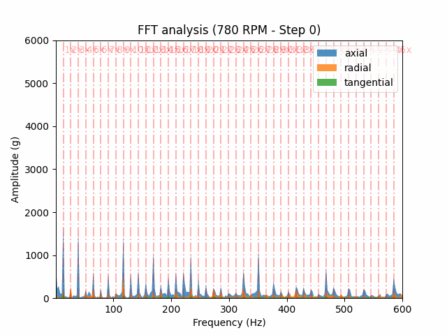

# Vibration Analysis notebooks

Jupyter notebooks developed to study vibration signals on industrial assets.

This notebooks was developed while I was making a vibration predictive maintenance course. This files helped me to understand the theoretical classes and provide a real "feeling" of this field. It is being used the [MAFAULDA](https://www02.smt.ufrj.br/~offshore/mfs/page_01.html) database, from the UFRJ university.

Within the file `py_functions.py` you will find the functions that was used at the notebooks, which are:

- Clean data
- Organize data
- Digital signal processing
- FFT calculation

## Imbalance example

Below an example of the evolution of imbalance in an industrial asset. The `.gif` was created at `make-gif-imbalance-data.ipynb`.

## How to use this repository

Download the `.zip` files from [MAFAULDA](https://www02.smt.ufrj.br/~offshore/mfs/page_01.html) database and unzip inside the `./data` folder.

